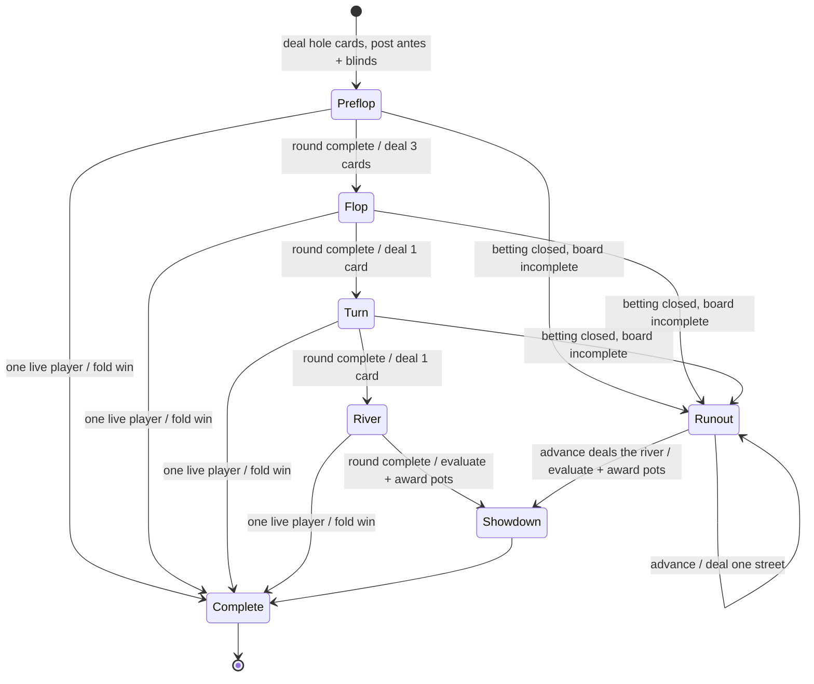
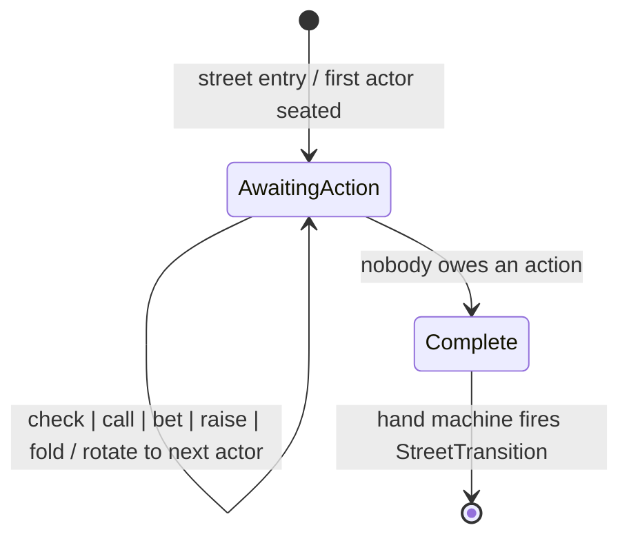

# Hold'em game-flow statechart

The hand engine (`src/holdem/`) is defined as a statechart of two composed
state machines:

* the **hand machine** (`src/holdem/street.rs`) — top-level lifecycle of a
  hand across streets;
* the **betting round machine** (`src/holdem/round.rs`) — one instance runs
  inside each betting street, handling player actions.

The shared data types, pot formation, and showdown resolution live in
`src/holdem/mod.rs`. Randomized model checks for the invariants below live in
`tests/statechart.rs`.

## Hand machine

States are the variants of `Street`. Each betting state hosts a betting round
machine; the hand machine only transitions when that round reports
`RoundStatus::Complete`.

Transitions are named by `StreetTransition`:

| Transition | Guard | Effect |
|---|---|---|
| `Deal(next)` | round complete, ≥2 live players, betting still open | deal board cards, log a `Deal` event, enter a fresh betting round |
| `Deal(next)` | round complete, ≥2 live players, **betting closed** | park in `Runout`: deal nothing, prompt nobody, wait for an advance |
| `Showdown` | river round complete, ≥2 live players | return uncalled excess, evaluate hands, award every pot |
| `FoldWin` | one live player remains | return uncalled excess, award the whole pot without showdown |

Entry action for each post-flop street (`enter_betting_round`): reset
`last_bet`/`last_raise`/`wagers`, clear per-player `street_contribution`,
`acted`, and `must_call`, then seat the first actor clockwise from the button.
If nobody can act (everyone live is all in), the machine parks in `Runout`
instead of dealing the rest of the board.

## Runout

`Runout` is a real, persisted state, not a client animation (§V59): betting is
closed with two or more live players and the board is incomplete. It is the
condition `awaiting_advance`, and while the hand sits in it:

* `current_player` is `None` — it prompts nobody;
* `summary` is `None` — **no result exists yet**, so there is nothing about the
  outcome for a view to leak or embargo;
* every unfolded seat's hole cards are face up (`exposed_hole_cards`), and
  `leaders_now`/`odds_now` read the board as it stands.

`Hand::advance_runout` is the only exit, and it deals exactly one street. It is
driven from outside the machine by whichever comes first:

| Driver | Where |
|---|---|
| a seated human's press | `POST /tables/{id}/advance`, refused inside `RUNOUT_FLOOR_MS` of the last card |
| the always-armed deadline | driver tick, `RUNOUT_STEP_SECONDS` |

The deadline is always armed, so a table nobody is watching still finishes its
board; a press only ever brings a card forward. Dealing the river re-enters the
betting round, finds no actor, and transitions to `Showdown` — which is the only
place a result comes from once betting has closed. Pots are therefore awarded,
and the hand settles, exactly as the last card lands: no seat can be eliminated,
and no stack can move, before the board is face up.

## Betting round machine

State is `RoundStatus`:

The single source of truth is the guard `needs_action(player, last_bet,
contested)` — a player still owes an action while **any** of these hold:

1. an incomplete all-in raise obliges them to call (`must_call`);
2. their street contribution is below the current bet
   (`street_contribution < last_bet`);
3. the pot is still contested (at least two players can act) and they have
   not voluntarily acted this street (`!acted`; blind and ante posts do not
   count, which is what gives the big blind its preflop option).

When everyone else is all in, the lone player with chips owes nothing once
the bet is matched — no further wager could be called — so the board runs
out to showdown without prompting them.

The round is `Complete` exactly when no live, non-all-in player satisfies any
of the above. Both actor rotation (`next_actor`) and round completion use the
same predicate, so a street can never advance while someone still owes a
check or a call.

### Action effects

| Action | Guard | Effect |
|---|---|---|
| `Check` | `to_call == 0` | mark acted |
| `Call` | `to_call > 0`, stack > 0 | put `min(to_call, stack)` in the pot, mark acted |
| `Bet` | no bet yet, wagers < 4, not `must_call` | set `last_bet`, count a wager, reopen action |
| `Raise` | bet outstanding, wagers < 4, not `must_call` | raise `last_bet`; a **full** raise (≥ `last_raise`) reopens action, an incomplete all-in raise instead sets `must_call` on unmatched players |
| `AllIn` | stack > 0; if it exceeds a call, also wagers < 4 and not `must_call` | normalized to `Call`, `Bet`, or `Raise` for the whole stack |
| `Fold` | always (also out of turn via `fold_seat`) | remove from hand; may complete the round or end the hand by fold win |

Actions are validated (legality, then wager bounds) **before** any event is
logged or chips move; a rejected action leaves the hand untouched.

A player who runs out of time (SPEC §6, tables with more than one person at
them) has one of these actions played for them — `Check` when `to_call == 0`,
`Fold` otherwise — through the same entry point, so a timeout is an ordinary
transition of this machine and logs an ordinary event.

## Event log

Every transition appends `HandEvent`s in causal order: `Ante`/`SmallBlind`/
`BigBlind` at hand entry, one voluntary-action event per player action, a
`Deal` event on street entry, and `Award` events at resolution. Invariants
checked in `tests/statechart.rs`:

* deals appear in street order, each at most once;
* no action for a street is logged after a later street is dealt;
* before each `Deal`, every player who is neither folded nor all in has a
  voluntary action logged on the street that just ended;
* awarded chips always equal contributed chips (conservation);
* every hand terminates in `Showdown` or `Complete` with no current player.
